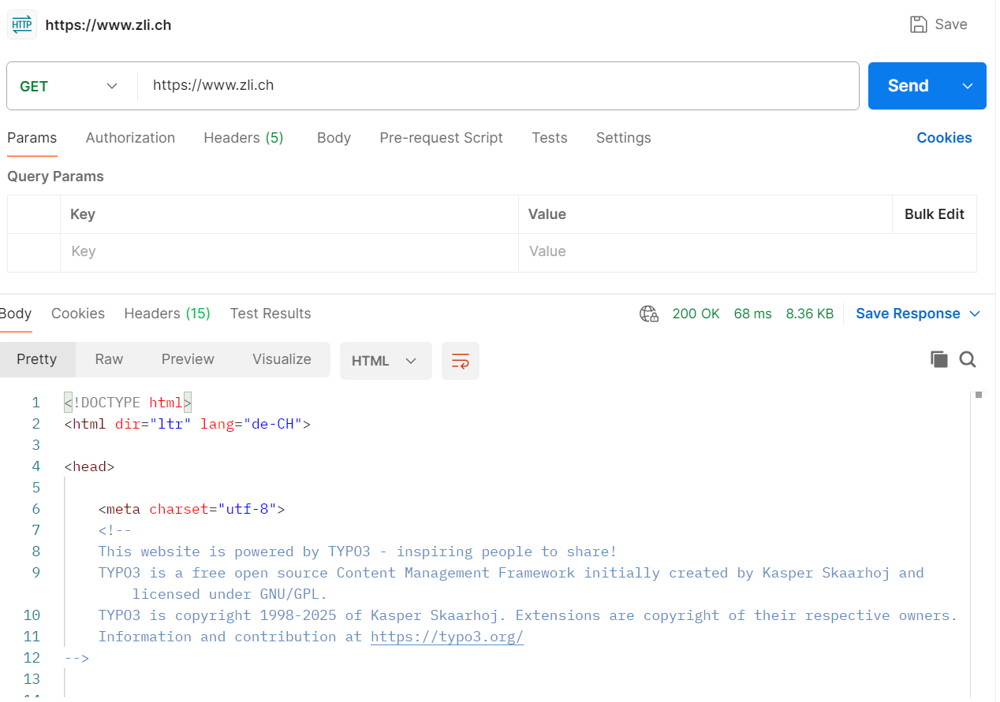
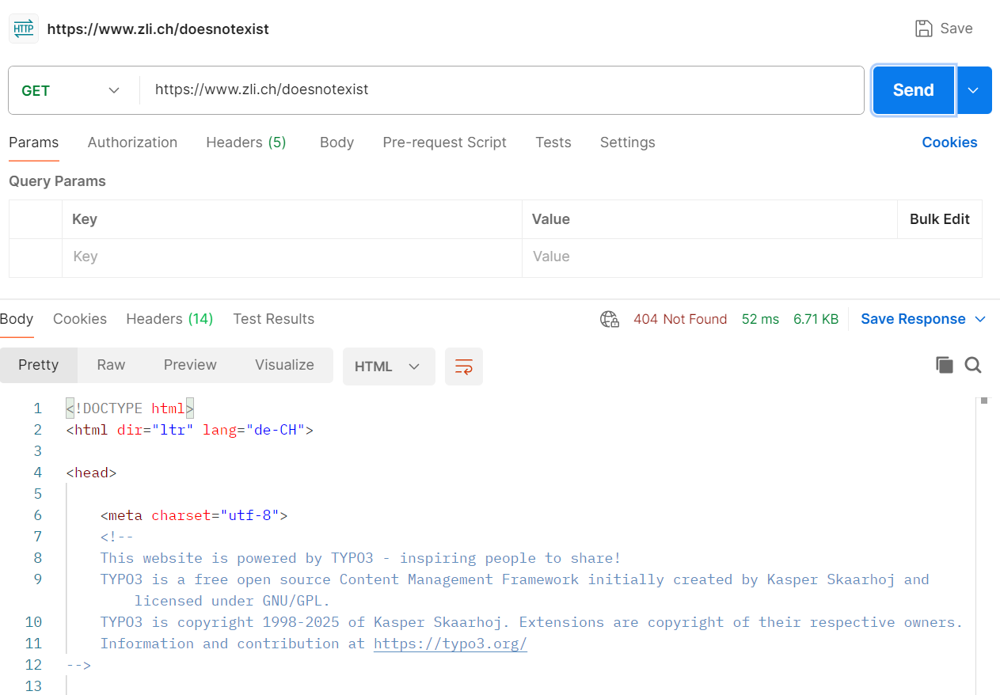
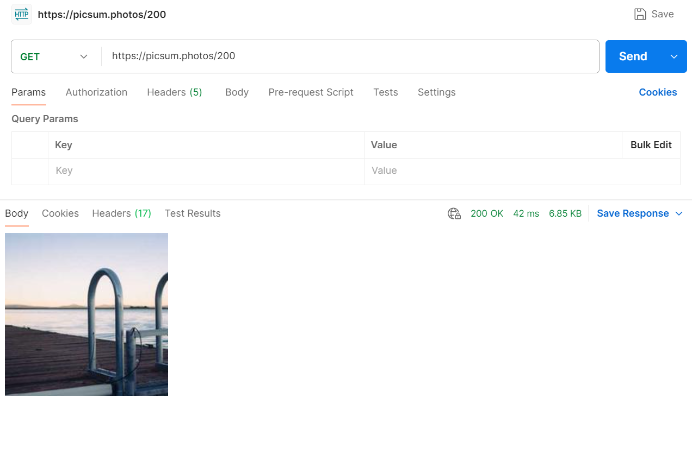
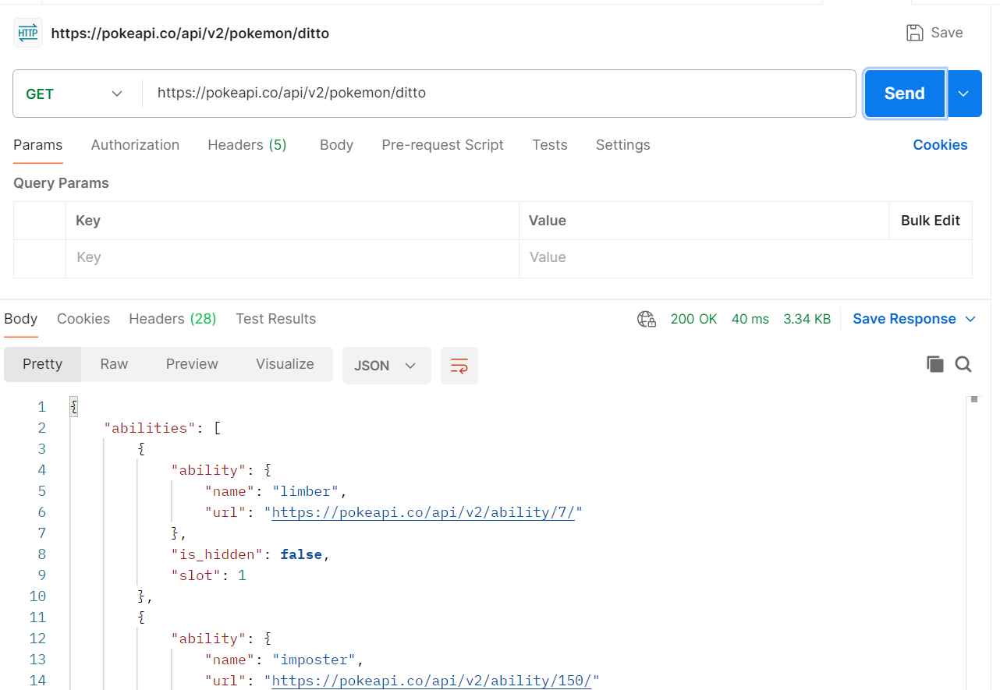
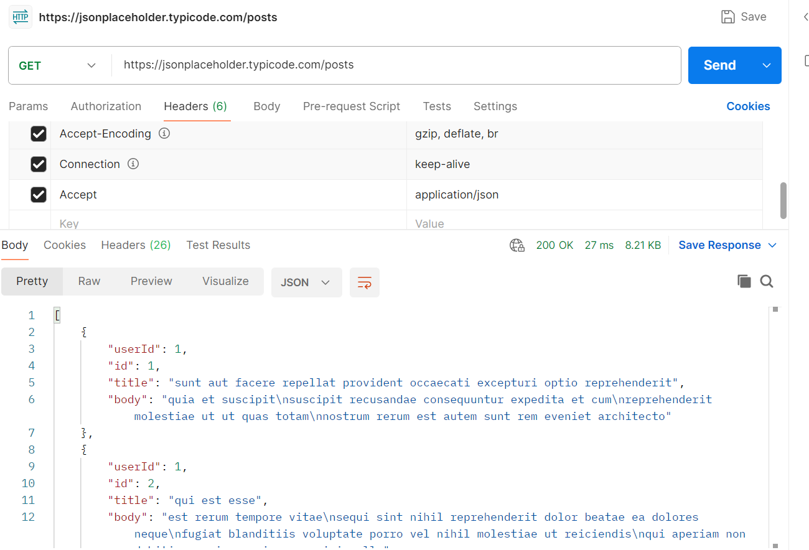
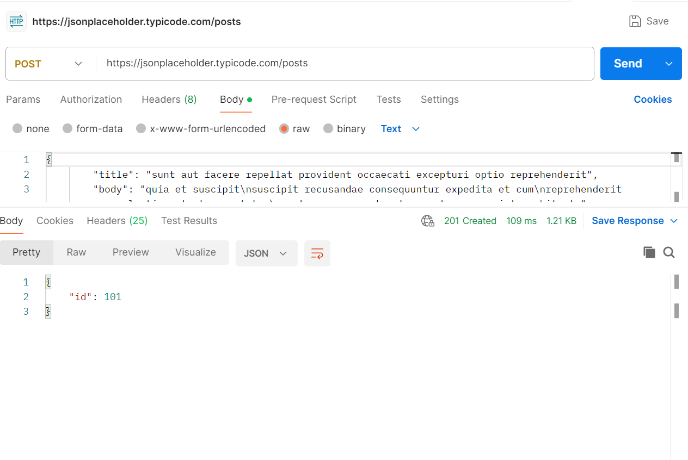

# 1)
Ich habe mich für Postman entschieden
# 2)
## Was kann man mit dem Tool grundsätzlich alles machen?
Verschiedene Arten von Requests (Http, Websockets, GraphQL...) verschicken und diese so konfigurieren,
wie man sie braucht.
## Was kann man für Einstellungen machen? Was bewirken die?
### Bei HTTP Requests
- Requests Method -> (GET, PUT, DELETE...)
- URL
- Header setzen
- Body Setzen
- Pre Request Scripts, die **vor** dem Request ausgeführt werden
- Tests schreiben, die **nach** dem Request ausgeführt werden
## Wie kann man Anfragen speichern und wieder laden?
Das Passiert automatisch. Die vergangenen Abfragen befinden sich in der History.
# 3)
## Fragen Sie die Webseite Ihres Betriebs oder von https://www.zli.ch als HTML ab

## Fragen Sie die Webseite Ihres Betriebs oder von https://www.zli.ch als so ab, dass ein HTTP Status 404 zurück gegeben wird

## Fragen Sie ein Bild mit einem GET Request von https://picsum.photos ab

## Fragen Sie die Daten eines Pokémons von der https://pokeapi.co als JSON ab

## Fragen Sie einen random Fact von https://cat-fact.herokuapp.com ab
Die Seite funktioniert nicht richtig
## Fragen Sie die Posts von https://jsonplaceholder.typicode.com als JSON ab

## Erstellen Sie nun hier selbst einen neuen Post mit einem POST Request

